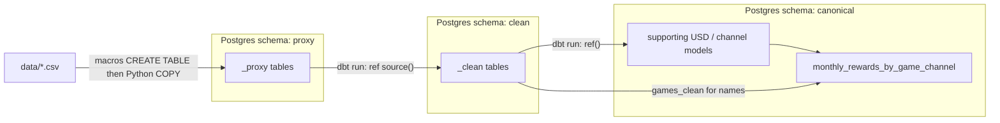

# Solution map (for reviewers)

This repository still contains the original take-home prompt in [`README.md`](README.md). This file is the **candidate solution index**: where each deliverable lives, how the local environment is layered, and how data is created and loaded without a workflow orchestrator.

Database credentials are not in git. They live in a local `.env` (gitignored). `profiles.yml` reads them via `env_var()`.

---

## Deliverables

| # | Ask | Where to look |
| --- | --- | --- |
| 1 | Schema / ERD sketch of the model | [`models/canonical/README_monthly_rewards_by_game_channel.md`](models/canonical/README_monthly_rewards_by_game_channel.md) |
| 2 | Working SQL models (intermediate and final) and tests | [`models/`](models/) — `sources.yml`, [`models/clean/`](models/clean/), [`models/canonical/`](models/canonical/). Tests: column/model YAML next to each model, source tests in `models/sources.yml`, generic tests in [`tests/generic/`](tests/generic/) |
| 3 | Monthly breakdown for a stakeholder (chart / table) | [`deliverable/20260929_monthly_rewards_by_game_channel.html`](deliverable/20260929_monthly_rewards_by_game_channel.html) (open in a browser) **or** [`deliverable/20260929_monthly_rewards_by_game_channel.csv`](deliverable/20260929_monthly_rewards_by_game_channel.csv) |
| 4 | Written brief (assumptions, data quality, stakeholder questions, AI use, more time) | [`deliverable/20260929_written_brief.md`](deliverable/20260929_written_brief.md) |

**Working session log (not a numbered deliverable):** Cursor agent transcript (secrets redacted) plus wall-clock vs machine-time notes: [`deliverable/20260929_raw_conversation.md`](deliverable/20260929_raw_conversation.md).

The queryable Product table in Postgres is **`canonical.monthly_rewards_by_game_channel`**.

---

## Environment a reviewer is looking at

- **Warehouse:** local PostgreSQL. Database name: `zbd_development`.
- **Transform tool:** dbt (`dbt-postgres`), project name `zbd`, profile in repo-root [`profiles.yml`](profiles.yml).
- **No Airflow/Dagster/etc.** Load order is documented commands, not a scheduler.
- **Python:** [`scripts/dbt_macro_runner.py`](scripts/dbt_macro_runner.py) (run any dbt macro) and [`scripts/load_source_data.py`](scripts/load_source_data.py) (one CSV → one table per run). Connection helper: [`scripts/db.py`](scripts/db.py).
- **Database role:** loaders and dbt use `zbd_app` (not a superuser). Copy [`.env.example`](.env.example) to `.env`, then run [`scripts/provision_app_role.py`](scripts/provision_app_role.py) once as a superuser. That script grants `proxy` / `clean` / `canonical` and writes `POSTGRES_USER=zbd_app` while keeping `POSTGRES_ADMIN_*` for later role changes. It does not print passwords.

---

## Schemas and data flow

Three schemas, named so landing, typed copies, and the report layer cannot be confused:

| Schema | What it is | Object names |
| --- | --- | --- |
| `proxy` | Landing zone. CSV extracts as loaded. No business logic. | `games_proxy`, `players_proxy`, `earn_events_proxy`, `redeem_events_proxy`, `fx_rates_proxy` |
| `clean` | One dbt model per proxy table. Casts, trims, normalizes case. Same grain as source; rows are not dropped. | `games_clean`, `players_clean`, … |
| `canonical` | USD facts and the Product monthly rollup. | Supporting: `player_redemption_channel`, `earn_value_usd`, `redeem_value_usd`. **Output:** `monthly_rewards_by_game_channel` |



**Why three schemas:** proxy is reconstructible from files; clean is the typed contract for modeling; canonical is what Product (and a live SQL session) should open first. `generate_schema_name` is overridden so dbt does **not** prefix custom schemas (otherwise tables would land in names like `proxy_clean`).

---

## How objects get created (macros vs `dbt run`)

**Proxy tables are not dbt models.** They are created with **dbt macros** (`dbt run-operation`), because the landing DDL must exist *before* COPY and before `source()` tests.

- Macros live in [`macros/create_source_tables.sql`](macros/create_source_tables.sql) (`create_source_tables` and per-table `create_*_proxy_table`).
- Schema `canonical` is created by [`macros/create_canonical_schema.sql`](macros/create_canonical_schema.sql).
- Invoke via:  
  `python scripts/dbt_macro_runner.py create_source_tables`  
  `python scripts/dbt_macro_runner.py create_canonical_schema`

`run-operation` executes Jinja `run_query(...)` DDL. It does **not** build the graph of `.sql` models.

**Clean and canonical tables are dbt models** (`dbt run`). Each `.sql` file starts with:

```sql
{{ config(alias="<relation_name>", materialized="table") }}
```

Folder-level defaults in [`dbt_project.yml`](dbt_project.yml): `models.zbd.clean` and `models.zbd.canonical` use `+schema` and `+materialized: table`. Supporting canonical models *could* be switched to `ephemeral` so they are inlined and do not persist; they are tables today so a reviewer can `SELECT` them in the live session.

---

## How CSVs get into Postgres (Python, not dbt seeds)

After proxy tables exist:

```text
python scripts/load_source_data.py data/games.csv games_proxy
```

(and the same pattern for players, earn_events, redeem_events, fx_rates).

Each run **truncates** the named table and `COPY`s the file with CSV header. Filename and table name are separate arguments so a load cannot silently target the wrong relation. Schema comes from `POSTGRES_SCHEMA` (default `proxy`). This is the only “orchestration”: run macros, then five load commands, then `dbt run` / `dbt test`.

dbt **seeds** were not used; the assessment CSVs are treated as production-style extracts, not dbt-managed seed files.

---

## What `dbt run` / `dbt test` cover

1. `dbt run --select clean` — five `*_clean` tables from `source('proxy', '*_proxy')`.
2. `dbt run --select canonical` — channel lookup, USD earn/redeem facts, monthly Product table.
3. `dbt test` — source “did anything land?” (`expect_at_least_one_row`, keys) plus clean/canonical field tests (`not_null`, `unique`, `accepted_values`, `relationships` where they hold, `positive_numeric`). Exact CSV row counts are **not** asserted so later loads can add rows.

Point `DBT_PROFILES_DIR` at the repo root (the Python runners do this) so `profiles.yml` can see `.env`.

---

## Suggested live-query starting point

```sql
select *
from canonical.monthly_rewards_by_game_channel
order by report_month, game_name, channel;
```

Supporting grain if you want to walk FX or status-log logic: `canonical.earn_value_usd`, `canonical.redeem_value_usd`.
