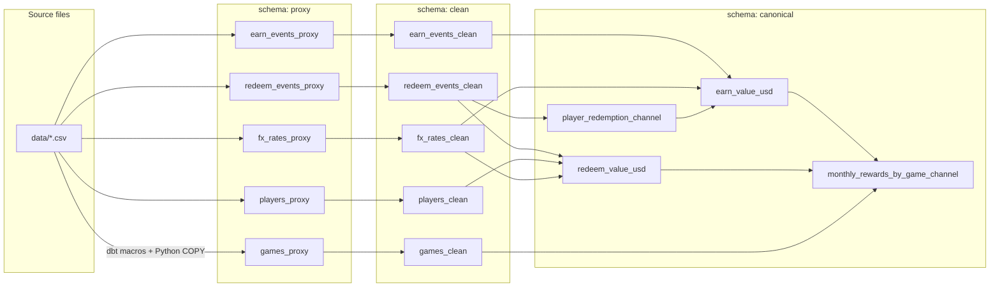
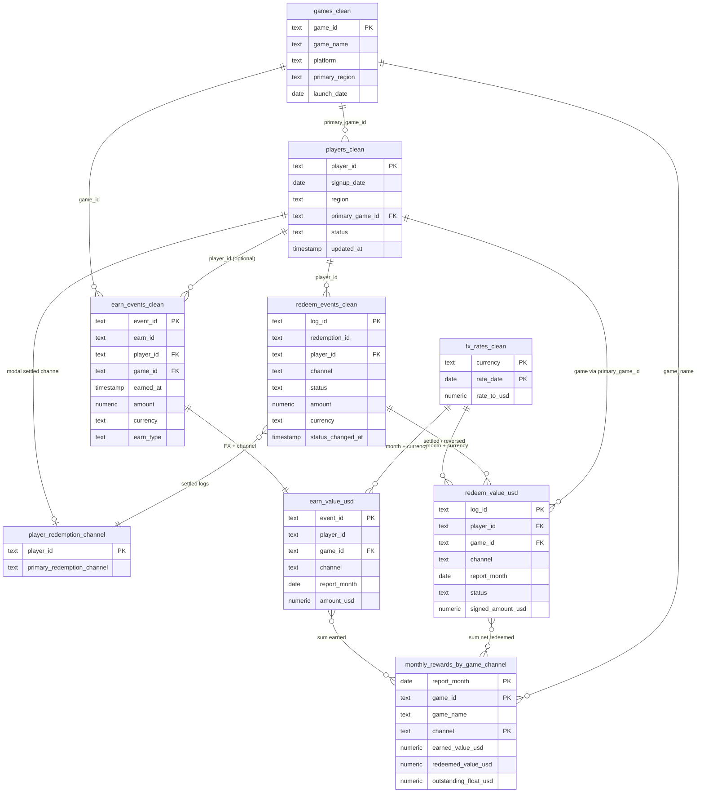

# Canonical data model

Product asked for a **monthly view of earned value, redeemed value, and outstanding float**, broken out by **game** and **redemption channel**.

This folder is that model. The table to hand to Product is **`canonical.monthly_rewards_by_game_channel`**. The other three models in this schema are supporting transforms (they can be ephemeral if you do not want them persisted).

## Schemas and data flow

Three Postgres schemas in `zbd_development`:

| Schema | Role | Naming |
| --- | --- | --- |
| `proxy` | Landing zone. CSV extracts loaded as-is. | `*_proxy` |
| `clean` | Typed, trimmed copies of proxy. No rows dropped. | `*_clean` |
| `canonical` | USD facts and the Product monthly rollup. | Product table plus optional supports |



**How work moves through the layers**

1. **proxy** — `create_source_tables` builds empty `*_proxy` tables. `load_source_data.py` COPY-loads each CSV. No business logic.
2. **clean** — one dbt model per proxy table. Casts, trims, normalizes case. Same grain as source.
3. **canonical** — convert to USD, attach game/channel, then roll up to month × game × channel.

## ERD: clean through Product

Relationships below are **logical** (how the SQL joins). Proxy does not enforce foreign keys; some earn `player_id` values have no player row.



## Product grain

`monthly_rewards_by_game_channel` is unique on **`report_month` + `game_id` + `channel`**.

| Column | Meaning |
| --- | --- |
| `earned_value_usd` | USD earned that month |
| `redeemed_value_usd` | USD settled minus reversed that month |
| `outstanding_float_usd` | Cumulative earned minus cumulative net redeemed through month end |

```sql
select *
from canonical.monthly_rewards_by_game_channel
order by report_month, game_name, channel;
```
